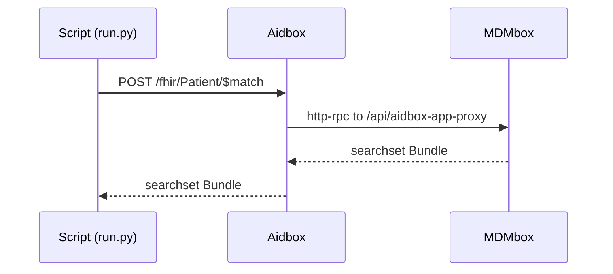

# MDMbox as an Aidbox App

This example shows how to configure Aidbox to forward
[$match](https://hl7.org/fhir/R4/patient-operation-match.html) requests to
MDMbox. This is useful if you want to keep your whole FHIR API on one domain:
clients call Aidbox, and Aidbox forwards the operation to MDMbox over http-rpc.

## Set Up Aidbox and MDMbox

First of all, start Aidbox and MDMbox (see the [parent README](../README.md)):

```bash
$ docker compose up
```

Once Aidbox is up and running, browse http://localhost:8888 and click "Continue
with Aidbox account". This will automatically issue a developer license for you
and redirect you back.

Then do the same with MDMbox. Open http://localhost:3003 and click "Sign in to
activate".

You'll see the [Welcome to MDMBox](http://localhost:3003/welcome) page. Click
your way through the setup steps to import sample patients and install a
matching model.

## Register MDMbox in Aidbox

The example is a plain Python script (standard library only — no dependencies):

```bash
$ python3 run.py
```

It prints each step and its request/response. The flow runs in two steps:

1. **PUT `/App/mdmbox.match`** — registers an Aidbox App that declares
   `POST Patient/$match`, delivered over http-rpc to MDMbox's `aidbox-app-proxy`
   endpoint.
2. **POST `/fhir/Patient/$match`** — runs a match **through Aidbox** for a
   sample patient from the imported set. Aidbox routes the operation to MDMbox,
   which runs the probabilistic match and returns a FHIR searchset Bundle
   (scores + match grades); the script prints the matches as a table.

## How it works

What the script above actually does is register MDMbox as an
[App](https://www.health-samurai.io/docs/aidbox/developer-experience/apps) in
Aidbox. It makes a `PUT /App/mdmbox.match` request with a body like this:

```json
{
  "resourceType": "App",
  "id": "mdmbox.match",
  "apiVersion": 1,
  "type": "app",
  "endpoint": {
    "type": "http-rpc",
    "url": "http://mdmbox:3000/api/aidbox-app-proxy",
    "secret": "mdmbox-match-secret"
  },
  "operations": {
    "patient-match": {
      "method": "POST",
      "path": [
        "fhir",
        "Patient",
        "$match"
      ]
    }
  }
}
```

There you list which operations you wish Aidbox to forward to the App. When a
match runs, the script itself is not in the request path — it only registers the
App and kicks off the request:


