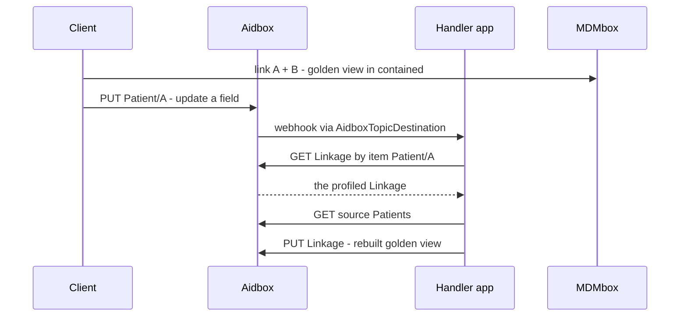

# Linkage Auto-Update

This example links two Patient records under a profiled `Linkage` whose
`contained` holds a **golden (survivorship) view**, then keeps that golden view
in sync automatically: whenever one of the source records is updated, an update
handler app rebuilds the golden view in the Linkage.

It combines the [linkage](../linkage) example (non-destructive `$link` with a
contained golden view) with the [auto-merge](../auto-merge) pattern (an Aidbox
webhook driving a handler app).

## Set Up Aidbox and MDMbox

First of all, start Aidbox and MDMbox (see the [parent README](../README.md)):

```bash
$ docker compose up
```

Once Aidbox is up and running, browse http://localhost:8888 and click "Continue
with Aidbox account". This will automatically issue a developer license for you
and redirect you back.

Then do the same with MDMbox. Open http://localhost:3003 and click "Sign in to
activate". Walk through the [Welcome to MDMBox](http://localhost:3003/welcome)
setup: import sample patients and install the matching model.

## Start the Update Handler App

The handler app is a **long-running service** — Aidbox calls it whenever a
Patient is updated. Start it from this directory:

```bash
$ docker compose up
```

This runs `update_handler.py` (Python standard library only) as the
`update-handler` service on the shared `mdmbox-playground` network, so Aidbox
can reach it at `http://update-handler:3302`.

## Run the Auto-Update Flow

The driver is a plain Python script (standard library only — no dependencies):

```bash
$ python3 run.py
```

It prints each step and its request/response, colored green for success and red
for failure. The flow runs in eight steps:

1. **PUT `Patient/<A>`** — source A (has an address, no phone).
2. **PUT `Patient/<B>`** — source B (has a phone, no address; same name).
3. **POST `$link`** — group both under a profiled `Linkage` whose contained
   golden view unions their fields (address from A, phone from B).
4. **PUT `AidboxSubscriptionTopic/…`** — topic for `Patient/update`.
5. **POST `AidboxTopicDestination`** — webhook destination pointing at the handler.
6. **PUT `Patient/<A>`** (updated) — add an email; this update fires the webhook.
7. **GET `<handler>/api/events?patientId=<A>`** — poll the handler's flow log
   until the rebuild reaches a terminal state (`updated` / `no-linkage` / `error`).
8. **GET `Linkage`** — read the Linkage back; its golden view now also carries
   the newly added email alongside the address and phone.

## How it works

The two source records are complementary — same person, different fields — so
the `Linkage` created by `$link` carries a **golden (survivorship) view** in its
`contained` that unions both (see the [linkage](../linkage) example for the
Linkage shape and the one-active-per-reference rule).

The driver then subscribes to `Patient/update`. When a source record changes,
Aidbox POSTs the notification to the update handler. The handler
(`update_handler.py`):

1. finds the active profiled Linkage the updated Patient belongs to
   (`GET Linkage?item=Patient/<id>`);
2. reads the current source Patients (`Linkage.item` of type `alternate`);
3. rebuilds the golden view by unioning their fields;
4. **PUTs the Linkage back** with the refreshed `contained` golden view, using
   `If-Match` on the version it read.

Step 4 uses **optimistic concurrency**: if both source records change at nearly
the same time, two webhooks race to rebuild the same Linkage. The `If-Match`
header makes the losing write fail with `412 Precondition Failed`; the handler
then re-reads the Linkage and its sources and retries, so no update is lost.


