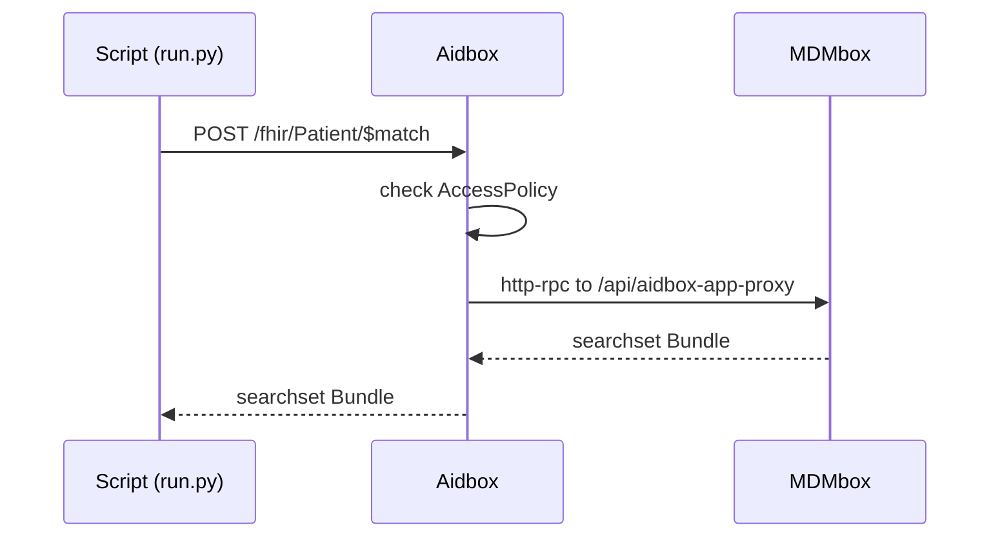

# MDMbox as an Aidbox App

This example shows how to configure Aidbox to forward MDMbox operations — [$match](https://hl7.org/fhir/R4/patient-operation-match.html) and [$merge](https://www.health-samurai.io/docs/mdmbox/merge-operation) — to MDMbox, and how to control who may call them with Aidbox [AccessPolicy](https://www.health-samurai.io/docs/aidbox/access-control/authorization/access-policies) resources. This is useful if you want to keep your whole FHIR API on one domain: clients call Aidbox, Aidbox checks their permissions, and forwards allowed operations to MDMbox over http-rpc.

## Set Up Aidbox and MDMbox

First of all, start Aidbox and MDMbox (see the [parent README](../README.md)):

```bash
$ docker compose -f ../docker-compose.yaml up
```

Once Aidbox is up and running, browse http://localhost:8888 and click "Continue with Aidbox account". This will automatically issue a developer license for you and redirect you back.

Then do the same with MDMbox. Open http://localhost:3003 and click "Sign in to activate".

You'll see the [Welcome to MDMbox](http://localhost:3003/welcome) page. Click your way through the setup steps to import sample patients and install a matching model.

## Run the Example

The example is a plain Python script (standard library only — no dependencies):

```bash
$ python3 run.py
```

It prints each step and its request/response:

1. **PUT `/App/mdmbox.match`** — registers an Aidbox App that declares `POST /fhir/<type>/$match` and `POST /fhir/$merge/v2`, delivered over http-rpc to MDMbox's `aidbox-app-proxy` endpoint.
2. **PUT Clients and AccessPolicies** — creates two API clients and the policies that say what each of them may do.
3. **`mdm-operator` runs Patient `$match`** — allowed. Aidbox routes the operation to MDMbox, which runs the probabilistic match and returns a FHIR searchset Bundle (scores + match grades); the script prints the matches as a table.
4. **`mdm-operator` runs Practitioner `$match`** — denied with HTTP 403.
5. **`mdm-operator` previews Patient `$merge`** — denied with HTTP 403.
6. **`mdm-steward` previews Patient `$merge`** — allowed. The script merges the two top matches from step 3 with `preview=true`, so MDMbox returns the planned changes and nothing is written.
7. **`mdm-steward` previews Practitioner `$merge`** — denied with HTTP 403.

Denied requests are rejected by Aidbox and never reach MDMbox.

## How it works

### The App

The script registers MDMbox as an [App](https://www.health-samurai.io/docs/aidbox/developer-experience/apps) in Aidbox. It makes a `PUT /App/mdmbox.match` request with this body:

```json
{
  "resourceType": "App",
  "id": "mdmbox.match",
  "apiVersion": 1,
  "type": "app",
  "endpoint": {
    "type": "http-rpc",
    "url": "http://mdmbox:3000/api/aidbox-app-proxy",
    "secret": "mdmbox-match-secret"
  },
  "operations": {
    "mdmbox-match": {
      "method": "POST",
      "path": ["fhir", {"name": "type"}, "$match"]
    },
    "mdmbox-merge": {
      "method": "POST",
      "path": ["fhir", "$merge", "v2"]
    }
  }
}
```

There you list which operations you wish Aidbox to forward to the App. MDMbox maps each operation path to its API under `/api`: `POST /fhir/Patient/$match` in Aidbox becomes `POST /api/fhir/Patient/$match` in MDMbox, and `POST /fhir/$merge/v2` becomes `POST /api/fhir/$merge/v2`.

Each operation key becomes the id of an Aidbox `Operation`. Access policies refer to it as `operation.id`, so choose keys that do not collide with other operations in your Aidbox.

### Access policies

Aidbox checks every request to an App operation against its access policies before forwarding it. A request is allowed when at least one policy matches it. The script creates two policies, each linked to the clients it applies to.

Operators and stewards may run `$match` for Patient. The `type` route parameter from the operation path is available to the policy as `params.type`:

```json
{
  "resourceType": "AccessPolicy",
  "id": "mdm-match-patient",
  "engine": "matcho",
  "link": [
    {"resourceType": "Client", "id": "mdm-operator"},
    {"resourceType": "Client", "id": "mdm-steward"}
  ],
  "matcho": {
    "operation": {"id": "mdmbox-match"},
    "params": {"type": "Patient"}
  }
}
```

Only stewards may merge, and only Patient records. The merged resource type comes from the `source` reference in the request body:

```json
{
  "resourceType": "AccessPolicy",
  "id": "mdm-merge-patient",
  "engine": "matcho",
  "link": [
    {"resourceType": "Client", "id": "mdm-steward"}
  ],
  "matcho": {
    "operation": {"id": "mdmbox-merge"},
    "resource": {
      "parameter": {
        "$contains": {
          "name": "source",
          "valueReference": {"reference": "#^Patient/"}
        }
      }
    }
  }
}
```

MDMbox rejects a `$merge` whose `target` has a different type than its `source`, so checking the source type is enough.

The example authenticates with Basic client credentials to keep the script short. The same policies work with any credential Aidbox accepts: link a policy to a `User`, or match claims of an external JWT, for example `"jwt": {"realm_access": {"roles": {"$contains": "mdm-steward"}}}` instead of `link`.

### Request flow

When an operation runs, the script itself is not in the request path — it only registers the App and kicks off the request:



## Keep MDMbox Private

Access policies protect only the requests that go through Aidbox. A client that can reach MDMbox directly bypasses them. In this example MDMbox is published on port 3003 for the setup pages and runs with `MDMBOX_AUTH_ENABLED=false`.

In a real deployment, do not expose the MDMbox API to clients: keep it on a network that only Aidbox can reach. With [authentication](https://www.health-samurai.io/docs/mdmbox/authentication) enabled, MDMbox also verifies the client credentials that Aidbox forwards, but it does not evaluate access policies itself.
