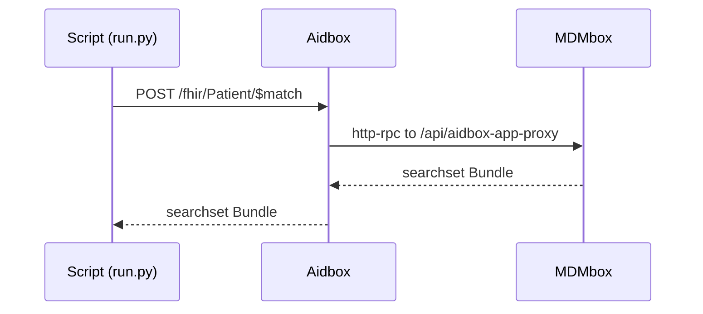

# MDMbox as an Aidbox App

MDMbox registers `App/mdmbox` automatically at startup. Its UI is available at `/mdmbox` on the Aidbox address, and API operations use `/api/*`. Set `MDMBOX_AIDBOX_APP_ENDPOINT_URL` when Aidbox reaches MDMbox at a different internal address. UI access is controlled by Aidbox AccessPolicies; no MDMbox UI role is required. This example registers a separate `App/mdmbox.match` to expose `$match` at the FHIR endpoint.

Automatic App setup is available starting with MDMbox `2609.0`. This example selects the released `2609` series through a Compose override; the shared configuration keeps Aidbox `2608`.

> We recommend Aidbox `2610` or later for App integration once response streaming is released. Earlier supported versions, including the `2608` image in the shared configuration, serve the UI and downloads with buffered responses. Intermediate UI updates arrive after the request finishes, and Aidbox must hold each complete export in memory.

This example shows how to configure Aidbox to forward [$match](https://hl7.org/fhir/R4/patient-operation-match.html) requests to MDMbox. This is useful if you want to keep your whole FHIR API on one domain: clients call Aidbox, and Aidbox forwards the operation to MDMbox over http-rpc.

## Set Up Aidbox and MDMbox

Configure the licenses as described in the [parent README](../README.md), then run from this directory:

```bash
docker compose -f ../docker-compose.yaml -f docker-compose.override.yaml pull
docker compose -f ../docker-compose.yaml -f docker-compose.override.yaml up -d
```

Once Aidbox is up and running, browse http://localhost:8888 and click "Continue with Aidbox account". This will automatically issue a developer license for you and redirect you back.

Open http://localhost:8888/mdmbox and sign in to Aidbox with `mdmbox-admin` and `password`, the development credentials supplied by this example. Click **Sign in to activate** if MDMbox needs activation.

You'll see the [Welcome to MDMbox](http://localhost:8888/mdmbox/welcome) page. Follow the setup steps to import sample patients and install a matching model.

## Register MDMbox in Aidbox

The example is a plain Python script (standard library only — no dependencies):

```bash
$ python3 run.py
```

It prints each step and its request/response. The flow runs in two steps:

1. **PUT `/App/mdmbox.match`** — registers an Aidbox App that declares `POST Patient/$match`, delivered over http-rpc to MDMbox's `aidbox-app-proxy` endpoint.
2. **POST `/fhir/Patient/$match`** — runs a match **through Aidbox** for a sample patient from the imported set. Aidbox routes the operation to MDMbox, which runs the probabilistic match and returns a FHIR searchset Bundle (scores + match grades); the script prints the matches as a table.

## How it works

What the script above actually does is register MDMbox as an [App](https://www.health-samurai.io/docs/aidbox/developer-experience/apps) in Aidbox. It makes a `PUT /App/mdmbox.match` request with a body like this:

```json
{
  "resourceType": "App",
  "id": "mdmbox.match",
  "apiVersion": 1,
  "type": "app",
  "endpoint": {
    "type": "http-rpc",
    "url": "http://mdmbox:3000/api/aidbox-app-proxy",
    "secret": "mdmbox-match-secret"
  },
  "operations": {
    "patient-match": {
      "method": "POST",
      "path": ["fhir", "Patient", "$match"]
    }
  }
}
```

There you list which operations you wish Aidbox to forward to the App. When a match runs, the script itself is not in the request path — it only registers the App and kicks off the request:


